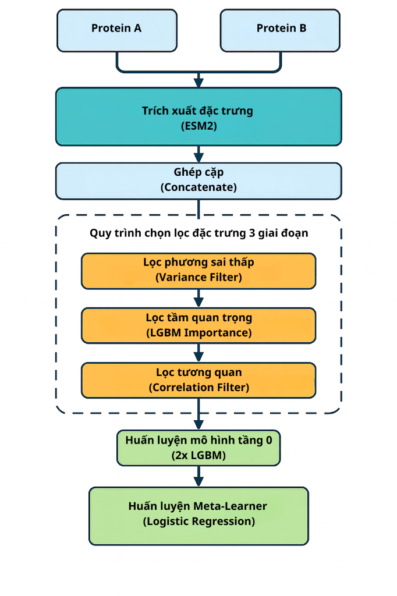

# E-StackPPI: Dự đoán tương tác Protein-Protein với ESM-2 và Stacking Classifier

[](https://www.python.org/downloads/)
[](LICENSE)

## 📋 Tổng quan

**E-StackPPI** là phương pháp dự đoán tương tác protein-protein (PPI) dựa trên:

- **ESM-2** (650M parameters): Mô hình ngôn ngữ protein để trích xuất embeddings
- **Chọn lọc đặc trưng 3 giai đoạn**: Variance → Importance → Correlation
- **Stacking Classifier**: 2×LightGBM + Logistic Regression meta-learner

## 🏗️ Kiến trúc



## 📁 Cấu trúc thư mục

```
EStack-PPI/
├── pipelines/              # Core modules
│   ├── __init__.py
│   ├── selectors.py        # CumulativeFeatureSelector
│   ├── pipeline.py         # Pipeline factory
│   ├── utils.py            # Device detection, visualization
│   └── ablation.py         # Ablation study runner
├── data/                   # Dataset files
│   ├── yeast/
│   │   ├── sequences.fasta
│   │   └── pairs.tsv
│   └── human/
│       ├── sequences.fasta
│       └── pairs.tsv
├── run_estackppi.py        # Main pipeline script
├── run_ablation.py         # Ablation study script
├── extract_esm2.py         # ESM2 embedding extraction
├── requirements.txt
└── README.md
```

## 🚀 Quick Start

### 1. Installation

```bash
git clone https://github.com/mxuanvan02/EStack-PPI.git
cd EStack-PPI
pip install -r requirements.txt
```

### 2. Google Colab

```python
# Cell 1: Clone & Install
!git clone https://github.com/mxuanvan02/EStack-PPI.git
%cd EStack-PPI
!pip install -q torch transformers lightgbm biopython scikit-learn pandas numpy tqdm h5py matplotlib

# Cell 2: Import
from pipelines.pipeline import create_full_pipeline
from pipelines.ablation import run_ablation_study
from pipelines.utils import plot_roc_pr_curves

# Cell 3: Run
pipeline = create_full_pipeline(
    variance_threshold=0.002,
    importance_quantile=0.90,
    corr_threshold=0.90,
    use_gpu=True
)
pipeline.fit(X_train, y_train)
y_pred = pipeline.predict(X_test)
```

### 3. Run Ablation Study

```python
from pipelines.ablation import run_ablation_study

results_df, predictions = run_ablation_study(
    X, y, n_splits=5, use_gpu=True
)
```

## 📊 Ablation Variants

| Variant | Description |
|---------|-------------|
| Baseline (LR) | ESM2 + Logistic Regression |
| Baseline (LGBM) | ESM2 + Single LightGBM |
| Var-Only | Variance filter only |
| Var + Importance | Variance + LGBM Importance |
| Full 3-Stage | Variance + Importance + Correlation |
| Single LGBM | Full selector + Single LGBM (no stacking) |

## 📈 Metrics

The pipeline evaluates with 8 metrics:

- **Accuracy, Precision, Recall, F1**
- **Specificity, MCC**
- **ROC-AUC, PR-AUC**

## 📊 Datasets

| Dataset | Pairs | Proteins | Path |
|---------|-------|----------|------|
| DIP-Yeast | 11,190 | 2,530 | `data/yeast/` |
| DIP-Human | 73,076 | 10,340 | `data/human/` |

## 🔧 Parameters

| Parameter | Default | Description |
|-----------|---------|-------------|
| `variance_threshold` | 0.002 | Min variance to keep feature |
| `importance_quantile` | 0.90 | Cumulative importance cutoff |
| `corr_threshold` | 0.90 | Max correlation allowed |
| `n_estimators` | 500 | LGBM trees |
| `use_gpu` | Auto | GPU acceleration |

## 📜 Citation

```bibtex
@article{estackppi2024,
  title={E-StackPPI: Protein-Protein Interaction Prediction using ESM-2 and Stacking Classifier},
  author={...},
  year={2024}
}
```

## 📄 License

MIT License
